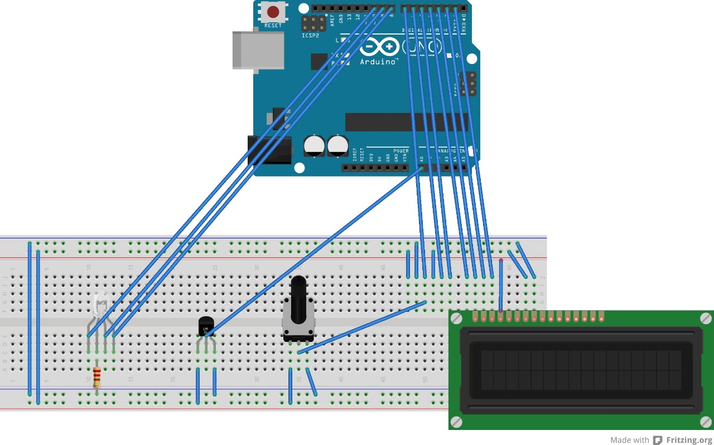

# LCD_Temperatura
Pantalla LCD muestra varios parámetros, Programado en Java y Arduino

Introduccio:
Proyecto integrando pantalla LCD con placa programable arduino, utilizando programas de desarrollo (Java y Arduino).
El poryecto Mostrara en pantalla LCD la temperatura que detecte el sensor de temperatura.

Diagrama de conexion:

Materiales:
-Pantalla LCD 16X2 
-Arduino uno (Cable de conecion USB tipo B)
-Protoboard 
-Cables
-Resistencias 220 OHMS 
-Ssensor de Temperatura LM35 
-LED RGB 
-Potenciometro
 
 * Sistema de desarrollo:
 -Pc o Partatil (Windows, linux o Ios)
 -Arduino 
 -Netbeans
